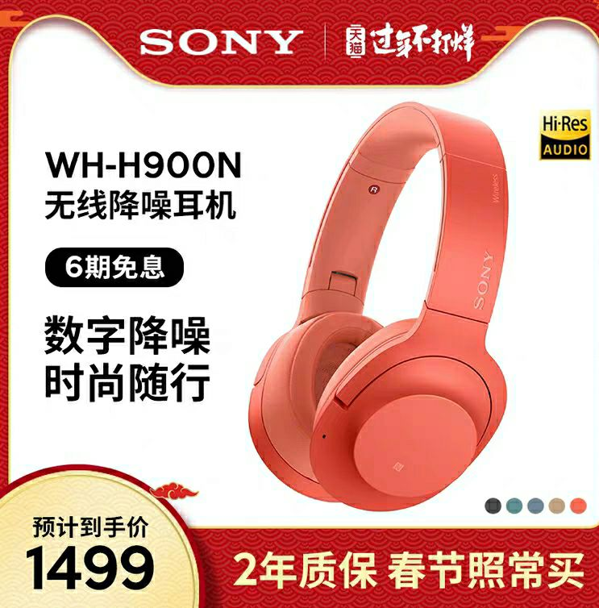
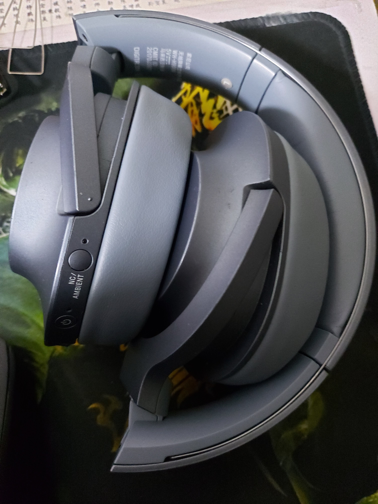
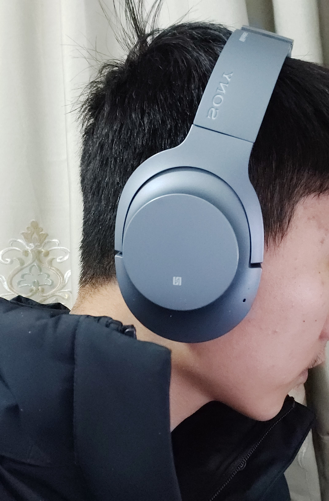
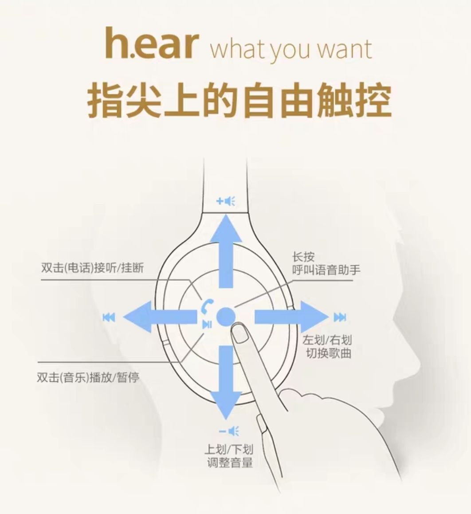
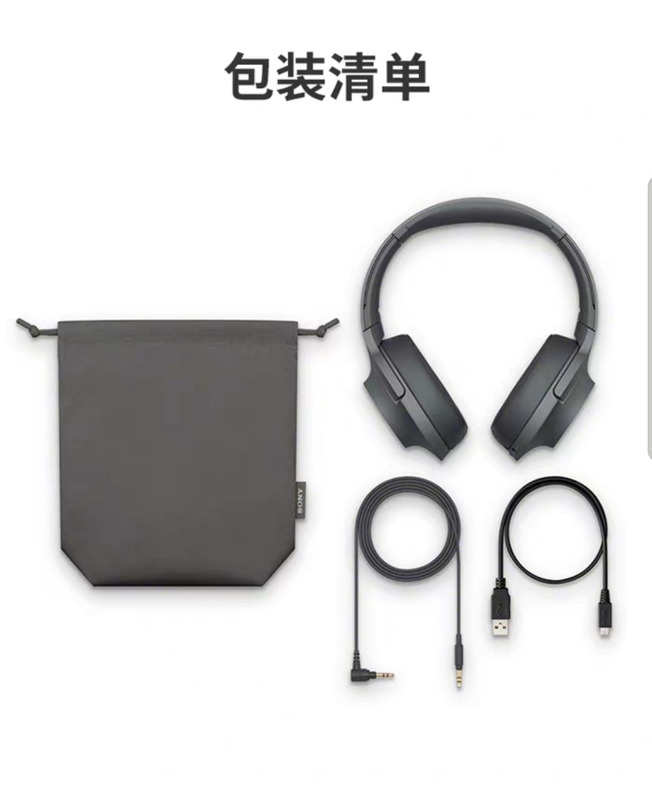

# 「好物分享」外设篇 1

## Sony H900N 蓝牙无线降噪耳机

### 时间： _2020.02.01_

#### 参考价￥ 1200

说起索尼大家都会联想到一个梗，‘索尼大法好’。众所周知，索尼在影像音乐等多个领域有着领先地位。这款索尼的头戴式降噪耳机定位于入门级别的降噪耳机，配色多样化，我的这款是没有红色那么骚的浅蓝色，购于 2018 年 8 月，已经有点旧了

上头试下，有伸缩调节，对于我这种头比较大的，需要展开 5cm 左右

有比较丰富的手势操作,左耳支持 nfc 一键连接，告别蓝牙连接的繁琐。

全套配件清单

有一说一，之前没有带过降噪耳机的我深深的被降噪给震撼住了，虽然是两三年前的产品了，但是放在今天，降噪和音质也能秒杀跟他一个价位的 beats 一条街。

无线状态下分为降噪模式，环境音，无三种模式，二十小时左右的续航，支持 Headphones app 操控。有线状态下和 3.5mm 耳机无异

推荐在自习时，舍友打游戏时开启降噪功能，即使没有在放歌，也能让心静下来。

不推荐在骑车马路上带，小命要紧，而且需要关闭降噪，不然风噪的声音很大。

冬天的时候，他可以充当耳罩的功能噢~~

在分体式蓝牙耳机如此流行的今天，特别是 airpods pro,给传统的头戴式耳机造成了很大的冲击。虽然带上去有点笨重，而且长时间佩戴耳朵会有点闷，但是头戴式无线降噪耳机提升了对于音质的追求，不失为广大耳机爱好者的一个选择。
