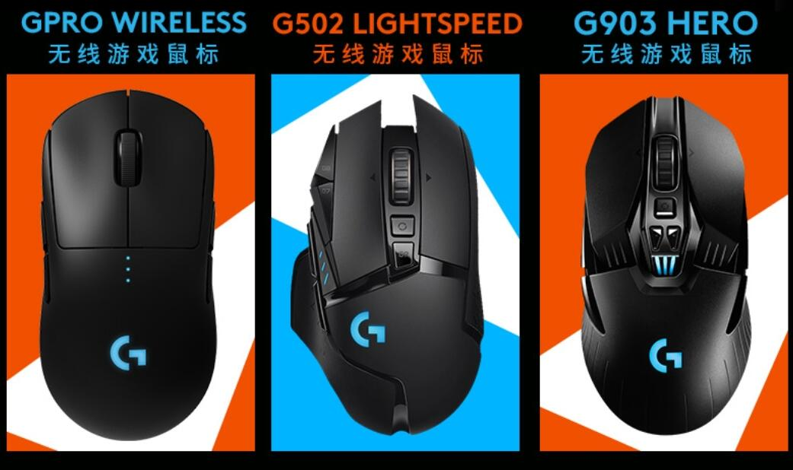
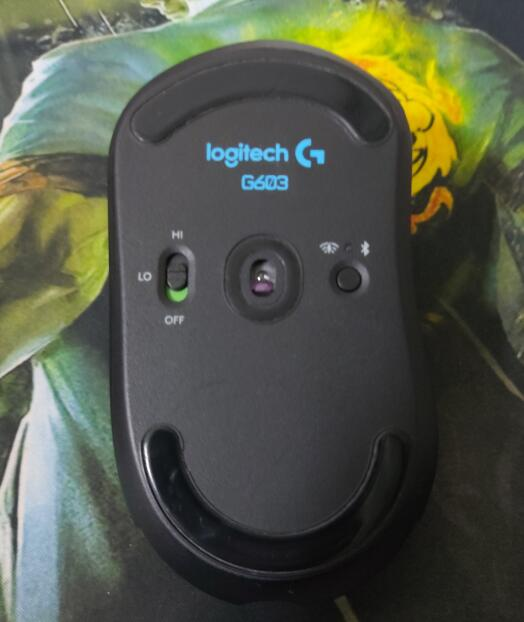
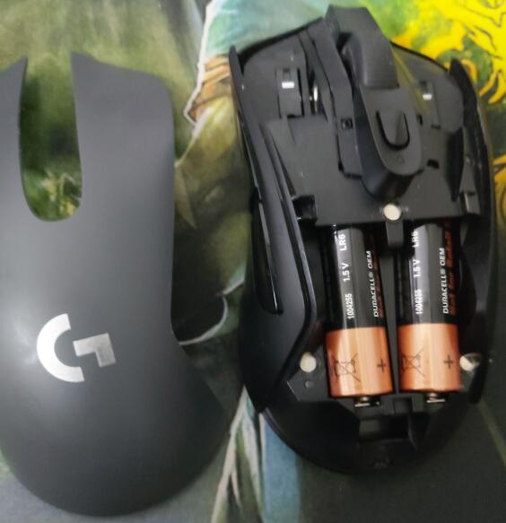
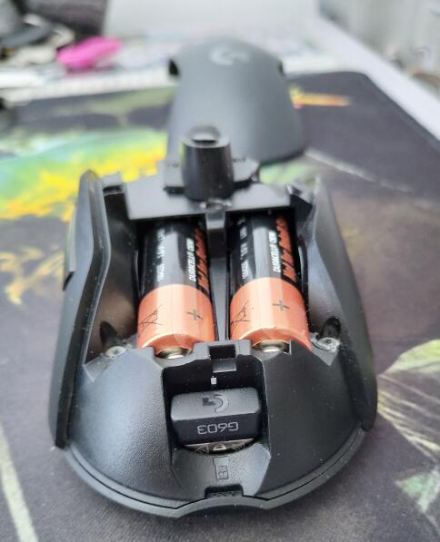

# 「好物分享」外设篇 2

## 罗技 G603 无线鼠标

### 时间： _2020.02.02_

#### 参考价￥ 449

相信在中高端的鼠标领域，罗技是全球首屈一指的厂商了，特别是 G 系列，涵盖了中高端以及无线领域。今天分享的一款鼠标是罗技的 G603 无线鼠标。

谈谈该鼠标的特点

#### 优点

- 支持 2.4G 无线传输，极低的延迟率，需要配合无线接收器使用
- 支持蓝牙设备连接，升级了 ipados 后，ipad 也能配合鼠标使用了，无需无线接收器
- 支持高性能模式，这样能给游戏带来更好的灵敏度
- 支持 dpi 调节 800-3200 自定义宏 两个拓展侧键
- 外观简洁大方，符合人体工学
- 罗技对于自身的无线技术非常自信，不支持有线模式
- 上盖可拆卸，降低维修更换的成本，寿命更长

#### 可以提升之处

- 配套的软件经常打不开，有点鸡肋，maybe 是我装了盗版软件
- G 字 logo 有些许掉色，不支持背光
- 蓝牙连接 ipad 操作有较大延迟，pc 正常
- 采用一或二节五号电池供电，配种方面较重，续航可以但不够环保

这款鼠标是女朋友送的生日礼物，之所以心心念念这款鼠标，还是因为用了一次金典的鼠标之后，就爱不释手了。然后就嚷嚷着生日礼物要这个，结果诶呀妈呀真香。

颜值方面就震撼了我，他不想 G502 那样棱角分明，也不像 G304 那样非常圆润，而是程曲线型。

G603 正面：dpi 调节按键及指示灯，阻尼滚轮，可拆卸盖板

G603 背面： LO HI 蓝牙与 2.4g 切换按键

G603 内部：组合式设计，可拆卸上盖板，接收器储存槽

造型上偏大，适合手比较大的用户，我的手比较小，握持感时这样的。手感因人而异，比起 M220 那样的入门蓝牙便携式鼠标差别是巨大的

#### 总结：

如果你是一位兼顾游戏与办公的用户，之前没有用过无线低延迟鼠标，建议尝试这一款 G603，你会发现低延迟和无线带来的畅快体验，无形之提升工作和游戏的效率。没有繁琐的线意味着更大的操作空间和拜托理线的烦恼（不用买理线器了~），同时罗技作为一流的外设厂商给机器的质量有了很好的保障。根据统计，用过两款雷柏 150 价位的鼠标，真心比不上罗技，用的不到一年就坏了，还不如多花点钱入罗技呢。其孪生兄弟 G703 也值得推荐，不过要贵一百多块钱。

别问，问就是要提高生产力~
