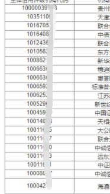
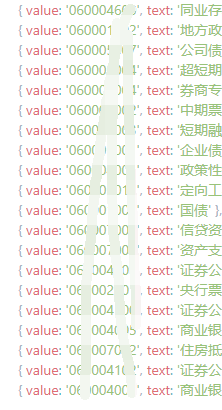
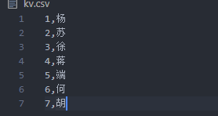

# python 脚本-生成键值对到剪贴板

## 关键词：python，pyperclip

### 时间：**2020.05.26**

#### 背景

#### 使用场景，从某数据库中导出了如下数据



#### 希望转化成下面键值对的形式



#### 这需要进行数据的大量比对，逐个填入 key 和 value，不仅影响工作的效率，也会导致筛选项和文字对不上的风险

#### 因此可以使用 python 的剪贴板功能，将快速处理文本



#### kvhelper.py

```

import pyperclip
import csv
with open('kv.csv', 'r',encoding="utf-8") as f:
  reader = csv.reader(f)
  print(type(reader))
  str = ''
  for row in reader:
        row = "{text:'%s',value:'%s'}," % (row[0],row[1])
        print(row)
        str+=row
pyperclip.copy(str)

```

#### 运行完此脚本后，即可在剪贴板中获得文本处理后的内容：

{text:'1',value:'杨'},{text:'2',value:'苏'},{text:'3',value:'徐'},{text:'4',value:'蒋'},{text:'5',value:'端'},{text:'6',value:'何'},{text:'7',value:'胡'},

#### 使用该方法处理此类重复性工作的优势是：

可以根据自己的需求更改脚本
轻量化，随时可开发，运行简单
