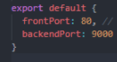
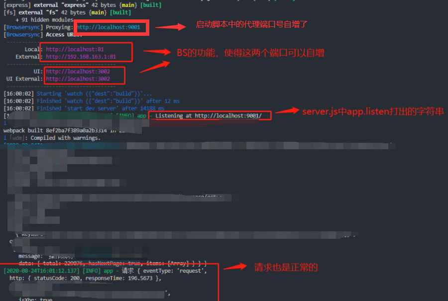

# 利用 portfinder 解决端口号冲突

## 关键词：端口，dev，portfinder，nodejs

### 时间：**2020.03.29**

#### 背景

矛盾：在多个项目启动的时候，会出现":9000 already in use"的情况，导致需要先停止一个项目，才能运行另一个项目，甚至有的时候需要去杀进程

比较不优雅的方式是就需要手动去修改项目代码中的启动端口号。



#### 目的：本地环境下，实现多项目启动时，端口号自增，从而避免端口冲突。

++++++为了避免对项目的副作用，需要遵循以下原则：+++++++

利用环境变量，使得端口号自适应只会作用于 dev 环境
在没有端口被占用的情况下，保证项目正常运行
无需开发者手动操作，对代码的改动尽可能小
因为在项目启动前，计算机中有什么端口号在被占用是无法直接感知的，这个时候如果有一个工具，类似执行 ps-ef 一样。如果端口号被占用，则自增，还是被占用则再自增...直到找到一个可以使用的端口号。

#### portfinder 恰好可以解决这一需求 https://www.npmjs.com/package/portfinder

#### 安装方式

```
 $ [sudo] npm install portfinder
```

#### 简单用法

getPort 类似于上面的自增逻辑，用于在一个范围内，寻找可用的端口号，在回调函数内执行对于 port 的操作

var portfinder = require('portfinder');

portfinder.getPort(function (err, port) {
//
// `port` is guaranteed to be a free port
// in this scope.
//
});

#### 自定义配置范围

portfinder.basePort = 3000; // default: 8000
portfinder.highestPort = 3333; // default: 65535

知道这些就足以满足我们的需求

##### 第一步：安装 portfinder，npm install --save-dev portfinder

##### 第二步：利用 getPort 获取可用端口号，启动脚本中

```
import portfinder from 'portfinder'
...
async function start() {
  ...
  //读取可用端口号
  portfinder.basePort = +config.backendPort
  portfinder.highestPort = +config.backendPort + 20

  await portfinder.getPort(function(err, port) {
    config.backendPort = port
    if (err) {
        console.log(err)// eslint-disable-line
    }
  })
...
  proxy: {
    target: `http://localhost:${config.backendPort}`,
  // 注入webpack全局变量
  devClientConfig.plugins.push(getBackEndPort(config.backendPort))
```

```
// DEFINE
export const getBackEndPort = (info) => {
  return new webpack.DefinePlugin({
    '__PORT__': info
  })
}

```

##### 第三步：服务端启动时,优先拿 webpack 注入变量 PORT

```
const PORT = process.env.PORT || config.backendPort || 9000
if (__DEV__) {
  portfinder.basePort = PORT
  portfinder.highestPort = PORT + 20
  portfinder.getPort(function(err, port) {
    if (err) {
      console.log(err)// eslint-disable-line
    }
    app.listen(port, function(err) {
      if (err) {
        throw err
      }
      logger.info(`Listening at http://localhost:${port}/`)
    })
  })
}

```

注意 eslint 将 PORT ignore 掉

##### 第四步：将 axios 的 requesy 方法的 baseUrl 端口号改掉

```
if (!__BROWSER__) {
  // console.log(__BACKENDPORT__)
  let port = ''
  if (__PORT__ && __DEV) {// eslint-disable-line
    port = __PORT__
  } else {
    port = require('../../../port-settings').default.backendPort
  }

  let apiRoot = `http://127.0.0.1:${port}`

  createRequest = (req) => {
    if (!req) {
      throw new Error('req must not be null')
    }
    let config = {
      baseURL: apiRoot,
      paramsSerializer: function (params) {
        return queryString.stringify(params)
      }
    }

```

##### 同时启动两个项目的时候，效果如下


