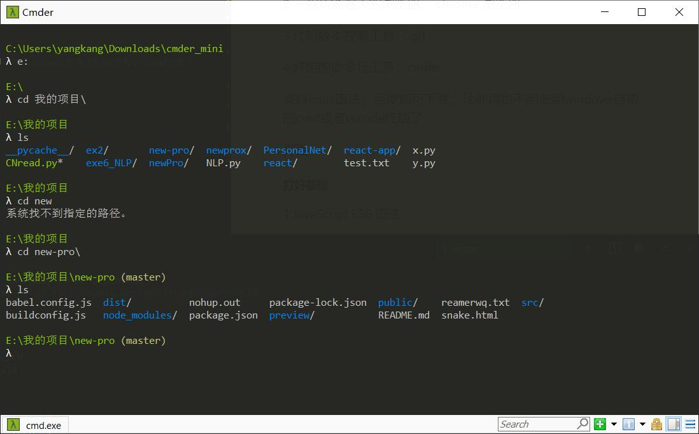
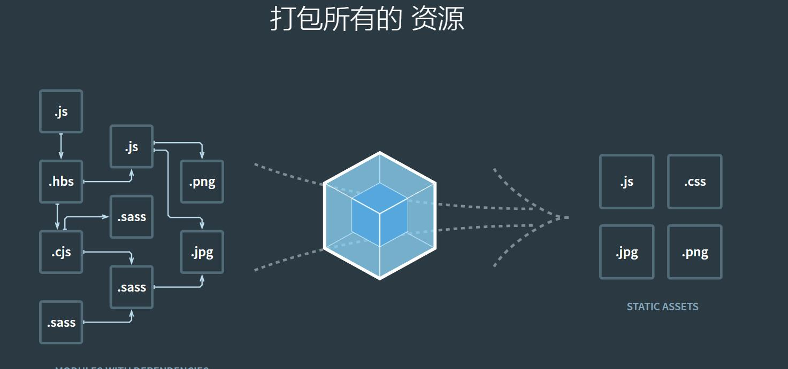

# web 开发工具网站分享

## 持续更新

### 时间：**2020.02.03**

#### 前言

对于任何事情都有一个从入门到精通的过程，踏入 web 开发这个行列，知识迭代非常快，意味着你时刻都要保持着一个热爱学习的心。
相信很多的伙伴嫌那些文档太难读懂，b 站上的视频教程废话太多，很难坚持下去。
有一点是肯定的，要耐得住性子，同时需要一定的英文阅读能力和实践操作能力，当然最好是有志同道合的伙伴或者良师益友。

#### 我将列举一些入门 web 前端开发的一些实用工具出来

##### **工欲善其事 必先利其器**

1.一款好用的代码编辑器： vscode 或 webstorm 或 idea

2.一款功能强大的浏览器： chrome 浏览器

3.代码版本控制工具： git

4.好用的命令行工具：cmder

支持 linux 语法，百度即可下载，让你再也不用使用 windows 自带的 cmd 或者 vscode 终端了

界面



##### **打好基础**

1.JavaScript ES6 语法

首推阮一峰的教程

link： https://es6.ruanyifeng.com/

2.CSS

推荐使用 sass，它是世界上最成熟、最稳定、最强大的专业级 CSS 扩展语言！

link： https://www.sass.hk/

3.构建类

- express 一个快速构建 web 项目的 nodejs 库

可以用很少的代码块，构建一个 web 服务出来

例如这个网站打包后的启动脚本

###### start.js

```
const fs = require('fs');
const path = require('path');
const bodyParser = require('body-parser');
var url = require('url');
const express = require('express');
var querystring = require('querystring');// 引入 querystring 库，也是帮助解析用的
const app = express();
var http = require('http');
var marked = require('marked');
var compression = require('compression')
// node启动时
// let port = process.env.NODE_ENV === "dev" ? '8080' : '80'

// nginx代理启动时
let port = 8080

console.log(process.env.NODE_ENV)

app.use(compression());
app.use(express.static('src'));  //加载静态文件

var urlencodedParser = bodyParser.urlencoded({ extended: false });

app.get('/getMdFile', urlencodedParser, function (req, res) {
  var arg = url.parse(req.url).query;

  //将arg参数字符串反序列化为一个对象
  var params = querystring.parse(arg);
  console.log(params)
  var data = fs.readFileSync(path.resolve(__dirname, `./mds/${params.type}/${params.id}/${params.type}${params.id}.md`), 'utf-8');    //读取本地的md文件
  res.end(JSON.stringify({
    body: marked(data)
  }));
});

app.use(bodyParser.json());
app.use(bodyParser.urlencoded({ extended: false }));
// 服务开启后访问指定编译好的dist文件下的数据
app.use(express.static(path.resolve(__dirname, '../dist')))
app.use(express.static(path.resolve(__dirname, '../public')))
app.get('*', function (req, res) {
  const html = fs.readFileSync(path.resolve(__dirname, '../dist/index.html'), 'utf-8')
  res.send(html)
})
// 后端api路由
// app.use('/api', userApi);
// 监听端口
app.listen(port);
console.log(`success listen at port:${port}......`);
```

- webpack，最主流的 web 项目打包工具

现在 web 项目的发布是离不开 webpack 打包的

下面这张图很简要的描述了 webpack 干了什么



一些诸如 vue-cli 脚手架快速构建项目工具，也是结合了 webpack 的。

这么说吧，它相当于把各种拓展语言，各种零部件组装起来，变成一种能够让浏览器识别的形式。它的配置项繁多，要想深入理解玩转它，也是需要极高的耐心和时间积累

4.框架类

- 入门首选 vue，是三大主流前端开发框架之一，教程简洁易懂，可以边做边学，查阅方便

link： https://cn.vuejs.org/

- 对于大型项目的开发，特别是做服务端渲染，seo 等， 推荐学习 react 框架

link: https://react.docschina.org/

##### **站在巨人的肩膀上**

1.echarts 一个由百度开发团队开发的 js 库

基于 canvas 用于制作各式各样的图表，有丰富的社区文化。优点是使用方便，往往能找到想要的例子进行个性化微调即可。缺点是基于 canvas，拓展性较差，自由度不高。

link： https://www.echartsjs.com/zh/index.html

2.d3 全名：Data-Driven Documents，多用于制作图形

d3 是比较高阶的一门 js 库了，如果对于数据可视化研究有需求或者兴趣，可以尝试去学习这个 它的自由度非常高，因为他不负责控制图形的展示，而是提供了丰富的 api，帮助你完成你天马行空的想象。在 bilibili 著名的 up 见齐 就是基于这个框架来做的可视化工具。


需要比较好的耐心和一定的英文阅读能力，暂时没有比较人性化最新版本教程。

link： https://d3js.org/

3.vant 一款轻量的 vue 组件库

在这里，你可以用寥寥几行代码，去使用一些常用的移动端组件。你可以看到很多当代 app 常见的 ui 视觉组件，比如 loading 动画，按钮勾选，弹出框等...

link: https://youzan.github.io/vant/#/zh-CN/

4.jquery js 第三方库的老大哥了

它的地位很高，你会发现前端开发几乎离不开这个库，因为真的很方便。无论是操作 dom，还是实现一些别的功能，他都能够几乎兼容所有浏览器，并且已经经历了很多年的考验了

官方 link：https://jquery.com/

学习 link：https://www.runoob.com/jquery/jquery-tutorial.html

5.lodash 一个一致性、模块化、高性能的 JavaScript 实用工具库

我们常常叫他 鲁大师，它的应用相当广泛。首先必须要强调一下，即使是从事前端工作，也要对于数据接口等有一定的了解。lodash 很好的给我们封装了高性能的常用的方法，比如排序，遍历，甚至深拷贝等等。使用起来比较方便，受到广泛的应用。

内置搜索功能，一般对于对象数组数据的操作，里面都有了。

link： https://www.lodashjs.com/

##### 未来将持续更新...
