# 基于 scrapy 框架爬取苏州大学所有的新闻标题信息

## 关键词： **scrapy** **爬虫** **搜索引擎**

### 时间：**2020.02.20**

#### 背景

由于毕设的需要，是基于校内网实现搜索引擎，但是之前没有接触过爬虫。通过一些资料的学习，达成成就：爬取了苏州大学新闻的标题。

#### scrapy 框架

基于 python，使用命令 pip install scrapy 即可安装。可以通过参考文档进行学习

https://scrapy-chs.readthedocs.io/zh_CN/latest/intro/tutorial.html

牢记一张图，起初看的时候是一脸懵逼的，但是随着进一步的学习发现，这个很关键赶紧码下来。

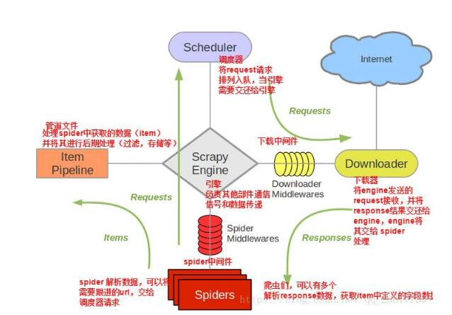

#### 初窥结构

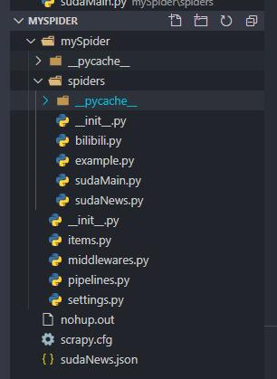

整个项目，除了 spiders/和 sudaNews.json 均通过`scrapy startproject xxx`生成

spiders 下存放的是爬虫文件，本例主要是 sudaNews.py

#### 分析

对于爬虫来说，困难的不是去把网站上的内容全部爬下来，而在于如何把网站上的内容`有序` `规范`的爬下来。不然效率是比较底下的，scrapy 框架比较方便从 ua 伪造、数据存储、自动化方面提供了便利。

#### 下面我们分析一下苏州大学的网站

通常而言，对于苏大的主站来说，90%以上存放的是新闻类型的内容。以苏大的主页 suda.edu.cn 为例


可以看到，大部分是图文信息，我的目标就是去爬取这些所有的标题

通过点击链接到列表页 http://www.suda.edu.cn/suda_news/sdyw/index.html

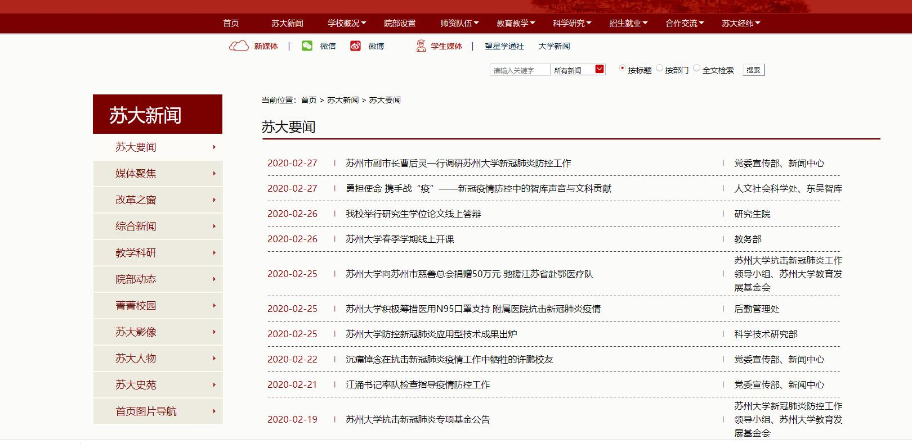

可以看到,所有的标题信息，包括超链接，时间，发布单位，标题，都存放在这样的页面里面

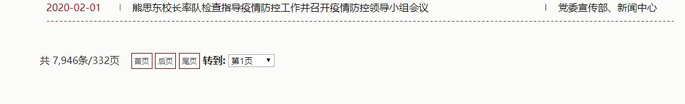

如果点击翻页，会发现 url 的变化，但是其实并页面的整体样式并没有改变

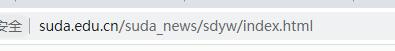

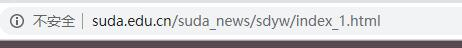

利用 xpath 提取我们想要的内容，借助 google 浏览器的插件 xpath-helper,根据匹配的结果会在页面中高亮显示出来

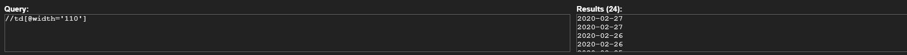

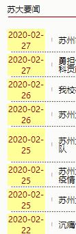

关于 xpath 语法，支持模糊匹配，类似于相对路径 .和..表示当前路径和上一路径。刚开始不熟悉的话，可以利用调试工具，copy xpath 出来，再根据特征进行修改

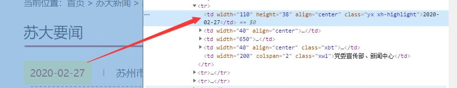

比如说拿到第一个标题的 xpath，复制下来的结果是 /html/body/table[3]/tbody/tr/td[2]/table[3]/tbody/tr[1]/td[1]

但是发现，他的匹配结果只有一个，而且其实不能代表时间戳元素的特性。经过观察发现，所有的时间戳都包含了 width=110 的属性，这成为了我们找到时间轴 xpath 特征量的关键 `//td[@width='110']` 代表匹配 width 为 110 的元素

自此放一下 sudaNews.py 的代码吧

```

# -*- coding: utf-8 -*-
import scrapy
import re
from mySpider.items import sudaNewsItem


class SudanewsSpider(scrapy.Spider):
    name = 'sudaNews'
    # allowed_domains = ['http://www.suda.edu.cn/suda_news/sdyw/index.html'] # 页面的域名范围
    start_urls = ['http://www.suda.edu.cn/suda_news/sdyw/index.html'] # 代表从这个页面作为爬虫的起始点
    basic_url = "http://www.suda.edu.cn" # 自定义属性，为下面程序做准备

    def parse(self, response):
        node_list = response.xpath(
            "//td[@width='110']") # 获得一个匹配的列表（时间轴）
        # print('3123123')
        # print(node_list.extract())

        # 对于每一个时间轴，进行遍历，利用相对路径的原理，找到超链接，发布单位，标题等信息
        # extract()后的结果是一个列表，所以要取[0].由于某些新闻有的字段为空，故加上判空的条件
        for node in node_list:
            item = sudaNewsItem()
            item['newsTime'] = node.xpath(
                './text()').extract()[0] if len(node.xpath(
                    './text()').extract()) > 0 else '1'

            item['newsHref'] = node.xpath(
                '../td[@width="650"]/a/@href').extract()[0] if len(node.xpath(
                    '../td[@width="650"]/a/@href').extract()) > 0 else '1'

            item['newsTitle'] = node.xpath(
                '../td[@width="650"]/a/text()').extract()[0] if len(node.xpath(
                    '../td[@width="650"]/a/text()').extract()) > 0 else '2'

            item['newsDepartMent'] = node.xpath(
                '../td[@width="200"]/text()').extract()[0] if len(node.xpath(
                    '../td[@width="200"]/text()').extract()) > 0 else '3'
            # item['newsDepartMent'] = 3
            print(item)
            print(111)
            yield item
            # 返回一个item对象，再次触发爬虫的时候，会继续执行之后的代码，而不是重新开始
        # 接下来是自动翻页的代码
        ·······
```

自此，完成的仅仅是一个页面标题的爬取，对于让爬虫自动翻页有两种思路

- 1.观察 url 变化规律，如上面的图，基本上是 index_number 的形式，那么可以通过这个来预测下一个链接应该爬什么。但是有一个缺点是，页面新闻的条数是在更新的，不好确定循环次数，也很有可能爬到不存在的页面，不太可行

- 2.找到‘下一页’按钮的超链接，模拟人工的方式，进行翻页。

第一种方式比较简单，就构建一个拼接字符串，循环累加即可实现。主要看看第二种。

检查一下’下一页‘元素的代码(祈祷是 a 标签的形式，这样就可以直接用 xpath 的[@href]提取出来了)

然而，却是 JavaScript 的形式，讲道理这样的设计不利于 seo，还好通过参数能够辨别出来地址，只需要将 goto('')内的内容提取出来，加上 base_url 即可。以上是接上面的代码：

```
  # 结束一次循环后，xpath匹配当前页的'后页'按钮
  next_url = response.xpath("//input[@value='后页']/@onclick").extract()[0]
  # 如果有，则对字符串进行处理拼接成完整的url地址
  if next_url:
      p2 = re.compile("'(.*)'")
      next_url2 = re.findall(p2, next_url)
      next_url = self.basic_url+next_url2[0]
      print(self.basic_url+next_url2[0])
      yield scrapy.Request(next_url, self.parse) # 这句话代表继续爬取下一页
```

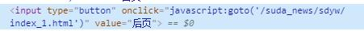

例行的附上管道文件和 item 文件

##### item.py 用于规定要存取的数据字段

```
import scrapy

class sudaNewsItem(scrapy.Item):
    # define the fields for your item here like:
    newsTime = scrapy.Field()
    newsHref = scrapy.Field()
    newsTitle = scrapy.Field()
    newsDepartMent = scrapy.Field()
```

##### pipeline.py 用于对于数据进行处理

```
import json

class MyspiderPipeline(object):
    def __init__(self):
        self.f = open("sudaNews.json", 'w', encoding='utf-8') # 解决中文乱码的问题

    def process_item(self, item, spider):
        content = json.dumps(dict(item), ensure_ascii=False)+',\n'
        self.f.write(content)
        return item

    def close_spider(self, spider):
        self.f.close()
```

ok，自此已经完成了一个页面的新闻数据爬取，总共条信息，以 json 的格式存储到了文件当中。总共 7000 多条信息，完全爬全了。
文件大小 1.7MB

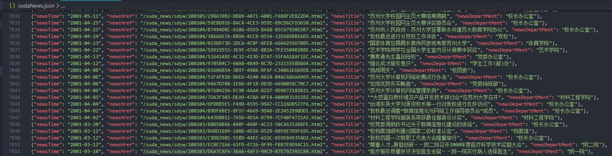

关于爬虫，还在学习当中，毕设是实现搜索引擎，覆盖了校内的所有页面，需要较大的时间成本。所以，从宏观上去规划那些想要的数据，是比较有重要的。这一步是爬取了所有的标题，并且把 url 给存放了下来，之后就可以通过读文件的方式，对于已经读取的地址，进行批量的访问，从而爬取所有文章的内容。

改爬虫程序在我的 github 上可以下载，同时有 bilibili 弹幕的爬虫文件。

github 地址：https://github.com/ykbolo/mySpider

敬请期待..
