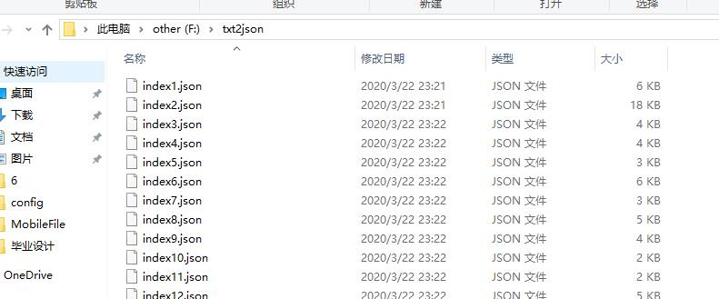
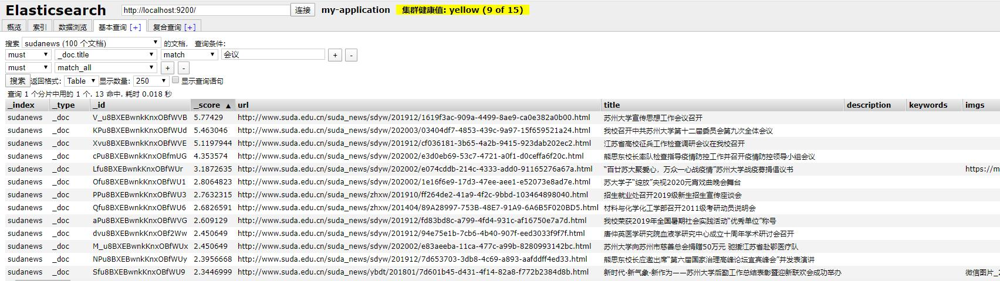

# node-client-api实现elasticsearch批量导入文档

## 关键词： **elasticsearch**  **搜索引擎** **json**

### 时间：**2020.03.23**

#### 背景

苦苦搜寻了很久关于elasticsearch批量导入数据的操作，最好是一键傻瓜式操作那种。但是看了bulk的介绍，似乎并不符合我的需要，虽然可以一次性输入很多语句，但是文字还是要一个个手动打上去呀。将整个文件夹中的json文档，导入到elasticsearch索引库里面去。事实证明，想得美---要自己写成程序实现批量导入。


#### 需要工具

- 上期爬下来的一系列json文件

- elastic-search-7.x
- elastic-search-head/kibana
- nodejs
#### 运行脚本

```
npm install @elastic/elasticsearch
```
```
node index.js
```

#### index.js

```

const { Client } = require('@elastic/elasticsearch')
var fs = require("fs");
// 建立连接
const client = new Client({ node: 'http://localhost:9200' })

// 创建文档
function createDoc (body) {
  console.log(body)
  client.index({
    index: 'sudanews',//索引名
    body:body//索引内容
  })
}
// 读取json文档
const readIndexFile=(count)=> {
  // 异步读取
  fs.readFile(`f://txt2json/index${count}.json`, function (err, data) {
    if (err) {
        return console.error(err);
    }
    
    console.log("异步读取: " + data);
    createDoc(data)
  });
}
// 以100个文档为例，自动化
function autoRun() {
  var count = 1
  for(count;count<=100;count++) {
    readIndexFile(count)
  }
}
// 执行
autoRun()

```

#### 结果预览

打开elasticsearch-head，输入查询条件，得到匹配结果




#### 参考文档

js-elasticsearch-api.7.x

https://www.elastic.co/guide/en/elasticsearch/client/javascript-api/current/index.html#

#### 为什么使用node而不是python？

需要用express搭建前端服务，将api用node来写，可以有效规避跨域问题。